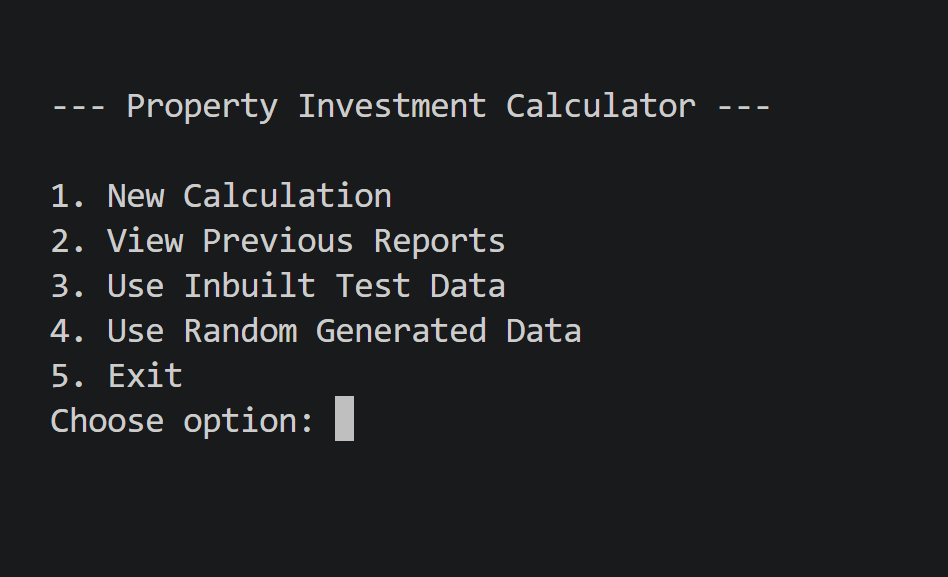
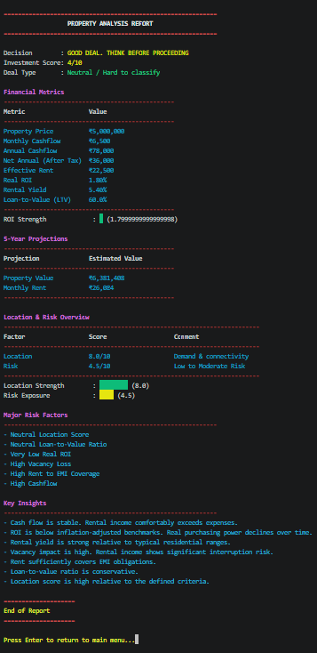
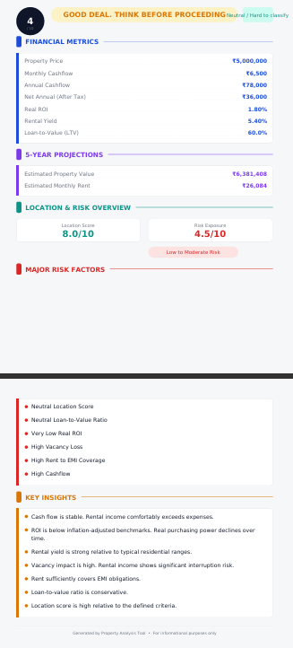

# Property Investment Calculator

A terminal-based property investment analysis tool built with Python. Enter property details and get a full financial breakdown, risk assessment, deal classification, and a downloadable PDF report — all without needing an internet connection or external APIs.

Built for the Indian real estate market.

---

## Screenshots







---

## What It Does

You input the numbers for a property you're evaluating — price, loan, rent, EMI, location quality — and the tool gives you:

- **Monthly and annual cashflow**
- **Real ROI** (after vacancy and maintenance)
- **Rental yield and LTV**
- **5-year projections** (property value and rent)
- **Location score** from four sub-factors
- **Risk score** with breakdown of risk reasons
- **Deal classification** — Cashflow Deal, Appreciation Deal, Balanced Deal, Speculative, or Risky
- **Investment decision** — scored from Excellent to Walk Away
- **Key insights** for each metric

Output is available as a **terminal report** (ANSI colored) or a **PDF report** saved locally.

---

## Project Structure

```
property-calculator/
├── assets/
│   └── fonts/              # DejaVu fonts used in PDF generation
├── data/
│   └── is_agreed.txt       # Stores user agreement status
├── outputs/
│   └── pdf/                # Generated PDF reports saved here
├── src/
│   ├── main.py             # Entry point
│   ├── agreement/          # Disclaimer agreement flow
│   ├── core/
│   │   ├── analysis_engine.py        # Scoring, insights, deal classification
│   │   ├── financial_calculations.py # All financial formulas + risk module
│   │   └── property_analyzer.py      # Orchestrates the full analysis pipeline
│   ├── data/
│   │   ├── data_sources.py   # User input, test data, random data modes
│   │   └── user_input.py     # Input collection with validation
│   ├── menu/
│   │   └── menu_manager.py   # Main menu and program flow
│   ├── reports/
│   │   ├── terminal_report.py    # Colored terminal output
│   │   ├── pdf_report.py         # Full PDF report generator
│   │   └── pdf_report_library.py # View previously generated PDFs
│   └── utils/
│       ├── common_utils.py   # Colors, console utilities
│       └── paths.py          # Centralized path management
├── requirements.txt
└── README.md
```

---

## Getting Started

### Requirements

- Python 3.10+

### Install dependencies

```bash
pip install -r requirements.txt
```

### Run

```bash
cd src
python main.py
```

---

## Input Modes

The main menu offers four options:

| Option | Description |
|--------|-------------|
| 1 | Enter your own property data |
| 2 | View previously generated PDF reports |
| 3 | Run with built-in test data |
| 4 | Run with randomly generated data |

**Note on vacancy rate:** Enter as a decimal. For example, enter `0.10` for 10% vacancy, not `10`.

---

## How the Scoring Works

The investment score is built from five factors:

| Factor | Max Contribution |
|--------|-----------------|
| Real ROI | +3 / -2 |
| Monthly Cashflow | +2 / -3 |
| Rent-to-EMI Coverage | +2 / -2 |
| Loan-to-Value (LTV) | +1 / -2 |
| Location Score | +2 / -2 |

**Score thresholds:**

| Score | Decision |
|-------|----------|
| ≥ 8 | Excellent Deal |
| ≥ 5 | Strong Deal — Negotiate and Proceed with Caution |
| ≥ 2 | Good Deal — Think Before Proceeding |
| ≥ -1 | Borderline — Needs More Analysis |
| ≥ -5 | Weak Deal — Avoid If Possible |
| < -5 | Terrible Deal — Walk Away |

---

## Deal Classification

The tool classifies each property into one of these deal types based on cashflow, ROI, rental yield, appreciation, and risk:

- **Cashflow Deal** — strong monthly income
- **Appreciation Deal** — low yield but high growth potential
- **Balanced Deal** — solid across income and growth
- **Speculative Deal** — high appreciation potential with elevated risk
- **Risky Deal** — risk score too high to recommend
- **Trash Deal** — negative cashflow, low ROI, weak yield
- **Neutral / Hard to classify** — mixed signals

---

## Location Score

Calculated as the average of four user-rated factors (each 1–10):

- Locality quality
- Future development potential
- Rental demand
- Political stability

---

## Output

### Terminal Report
A colored, structured report printed directly to the console with tables, bar charts, and insights.

### PDF Report
A formatted PDF saved to `outputs/pdf/` with a timestamped filename. Previous reports can be viewed from the main menu (Option 2).

---

## Assumptions

- All figures are in Indian Rupees (₹)
- Future value and rent projections use a **5-year horizon**
- Appreciation and rent growth inputs are expected as decimals (e.g. `0.05` for 5%)
- The tool does not factor in taxes, stamp duty, or registration costs
- Maintenance cost is entered annually and divided monthly in calculations

---

## Disclaimer

This tool provides estimates based on user inputs and general assumptions. It is not a substitute for professional financial advice. Always conduct your own due diligence before making investment decisions. The creator is not liable for any financial outcomes resulting from use of this tool.

---

## Author

**Madni Abid Khan**  
Email: madnikhan.work@gmail.com  
WhatsApp: +91 90997 16001  
GitHub: [github.com/heyy-madni](https://github.com/heyy-madni)